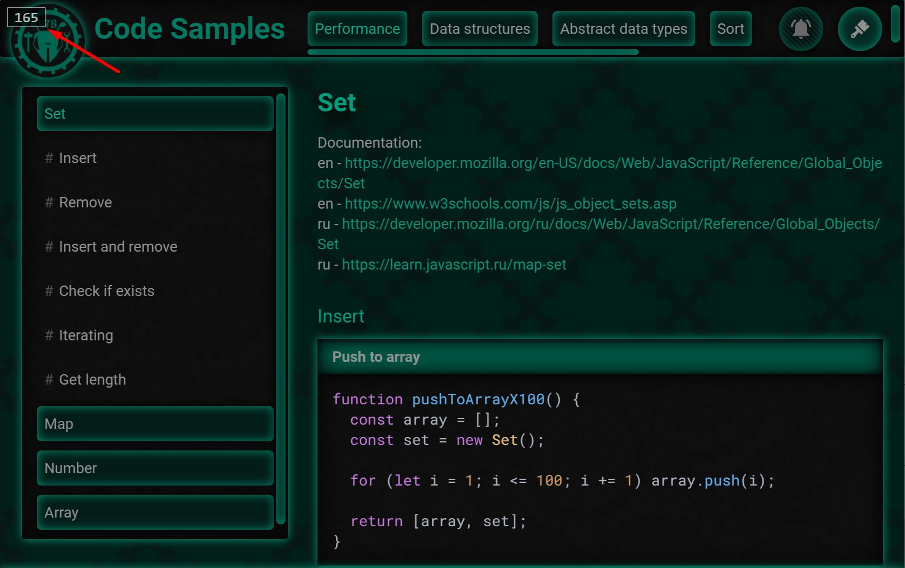

# ant478 FPS Meter

Simple tool for displaying page FPS.


## Usage
Tool can be installed and used in several ways, depending on situation:

### Option 1: NPM
#### For development and production use:
`npm i @ant478/fps-meter`

```js
// webpack.config.js
{
  plugins: [
    new CopyPlugin({
      patterns: [{
        from: 'node_modules/@ant478/fps-meter/dist',
        to: '<output-dir>/fps-meter',
      }],
    }),
  ],
}
```

```html
<!-- index.html -->
<head>
  <script defer src="/fps-meter/index.js"></script>
</head>
```

#### For development only use:
`npm i @ant478/fps-meter --save-dev`

```js
// webpack.config.js
{
  plugins: [
    new HtmlWebpackPlugin({
      templateParameters: {
        isDevelopment,
      },
    }),
    isDevelopment && new CopyPlugin({
      patterns: [{
        from: 'node_modules/@ant478/fps-meter/dist',
        to: '<output-dir>/fps-meter',
      }],
    }),
  ].filter(Boolean),
}
```

```html
<!-- index.html -->
<head>
  <% if (htmlWebpackPlugin.options.templateParameters.isDevelopment) { %>
    <script defer src="/fps-meter/index.js"></script>
  <% } %>
</head>
```

### Option 2: CDN
```html
<head>
    <!-- same as previous for development and / or production configuration differences -->
    <script defer src="https://cdn.jsdelivr.net/npm/@ant478/fps-meter@latest/dist/index.js"></script>
</head>
```

### Option 3: Console
```js
// in dev tool console
script = document.createElement('script');
script.src = 'https://cdn.jsdelivr.net/npm/@ant478/fps-meter@latest/dist/index.js';
document.head.appendChild(script);
```

## Configuration
### Configuration params:
* `show`: Default `false`. By default FPS meter will be hidden, until manually displayed with API. When `show` param given, FPS meter will be displayed automatically after page loading is finished.
* `log`: Default `false`. When given, tool will log debug messages to the console.
* `className`: Default `''`. Class name for the FPS meter element, can be used for applying custom styles.
* `interval`: Default `500`. Interval (ms) in which FPS value will be recalculated.
* `namespace`: Default `'fpsMeter'`. A key in `window` object, in which FPS meter API will be placed.


Tool is configured through setting data-attributes to the `script` element:
```html
<!-- for html usage -->
<script
  defer
  src="https://cdn.jsdelivr.net/npm/@ant478/fps-meter@latest/dist/index.js"
  data-show
  data-log
  data-class-name="fps-meter-class"
  data-interval="1000"
  data-namespace="fpsMeasurer"
></script>
```
```js
// for console usage
script = document.createElement('script');
script.src = 'https://cdn.jsdelivr.net/npm/@ant478/fps-meter@latest/dist/index.js';
script.setSttribute('data-show', '');
script.setSttribute('data-log', '');
script.setSttribute('data-class-name', 'fps-meter-class');
script.setSttribute('data-interval', '1000');
script.setSttribute('data-namespace', 'fpsMeasurer');
document.head.appendChild(script);
```

## API
Tool provides simple API, it is located in `window.fpsMeter`. Key in `window` object can be customized using `namespace` configuration param.
* `window.fpsMeter.show()`: Displays the FPS meter element.
* `window.fpsMeter.hide()`: Hides the element.
